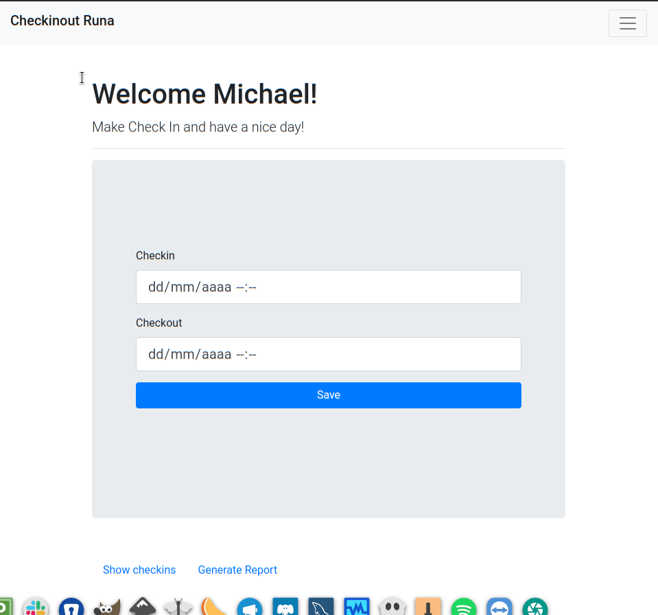
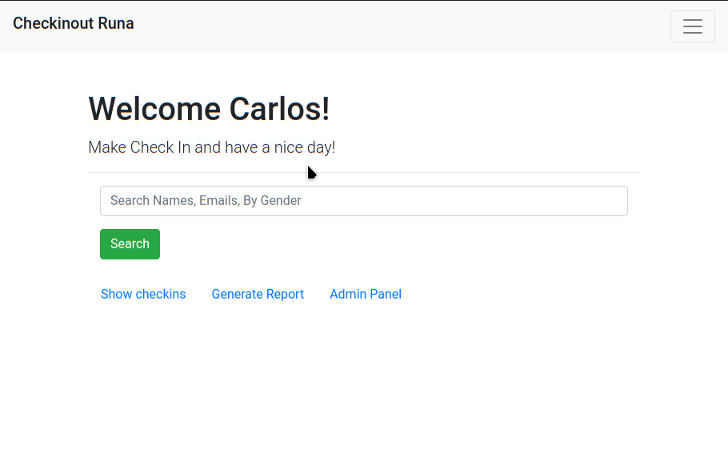
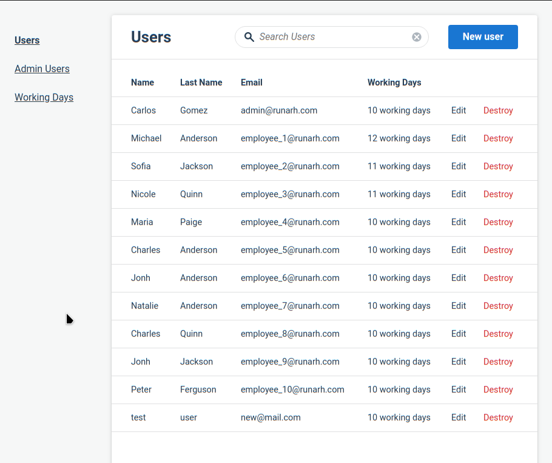
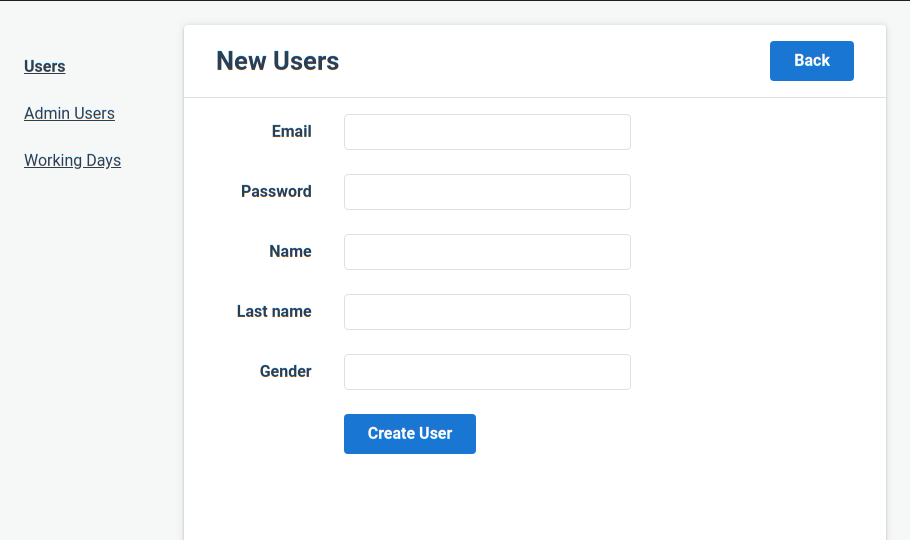
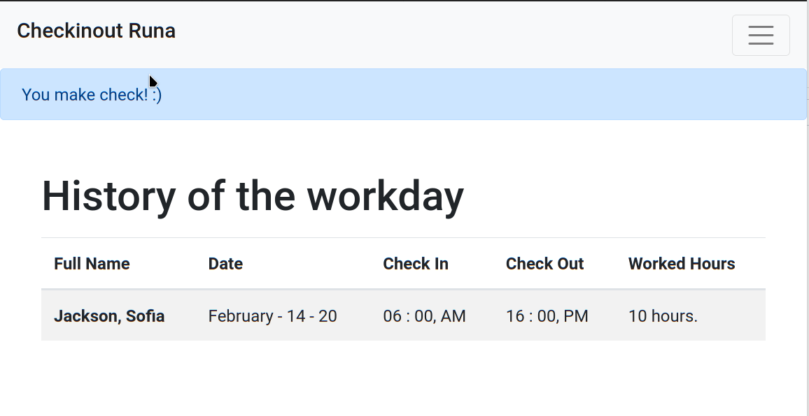
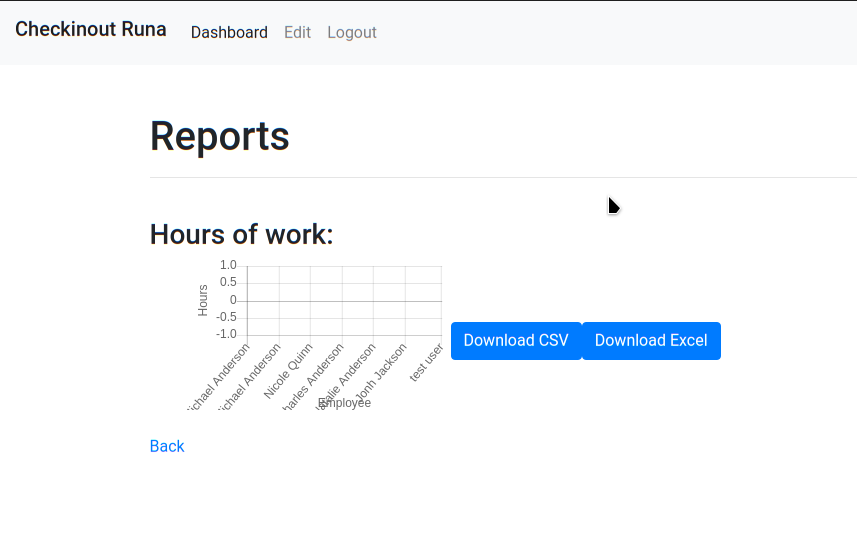
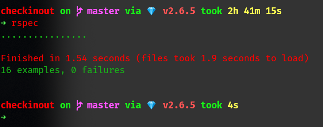

# README

Consiste en desarrollar un sistema para entrada y salida de empleados (CheckIn CheckOut)

## Requerimientos funcionales:

### Manejo de perfiles (Administrador, Empleados)

- **Como Administrador:**
- [*] Registro de empleados
- [*] Filtro para búsqueda de empleado en el index (Nombres, apellidos, correo, genero)
- [] Reporte de asistencias de 1..N empleados, con las horas trabajadas en un rango de tiempo.
---
- **Como Empleado:**
- [*] CheckIn | Checkout 
- [] Reporte de asistencias, con las horas trabajadas.

## Consideraciones:

- [*] Backend en Ruby on Rails
- [*] Puede hacer uso de una librería y framework para el frontend
- [*] Aplicar Unit testing y/o testing funcional
- API debe estar documentado
- [*] Usar PostgreSQL 
- El criterio del postulante será el punto más importante a evaluar

## Instrucciones:

- Configurar el usuario y contraseña de postgres en el config/database.yml
- Crear la base de datos y correr las migraciones: 'rails db:create db:migrate'
- Generar datos en la base con el archivo seed.rb: 'rails db:seed'
- Usuario administrador: **admin@runarh.com** contraseña: **secret**
- Usuario empleado: **employee_1@runarh.com** contraseña: **password** puede utilizar cualquier usuario del employee_1 al employee_10, @runarh.com

- Todos los usuarios deben autentificarse primero

- El admin puede:
  - buscar usuarios por los filtros indicados
  - ver una lista de usuarios con sus datos, incluyendo las horas trabajadas solamente por cada registro (falta implementar horas trabajadas en total por rango de fecha)
  - navegar hasta el panel de administracion (Panel Admin), donde podra crear usuarios administradores y usuarios empleados, ver registros de ambos

- El empleado puede:
  - ver sus registros de entradas
  - el reporte no fue implementado para el empleado ya que muestra todos los usuarios como si fuese admin

## No implementado
- El reporte no fue correctamente implementado, no suma todas las horas trabajadas por un empleado (Como admin)
- La libreria que se utilizo para hacer reportes fue semi implementada por falta de documentación (reports_kit), no esta renderizando la información correctamente quedo a medias
- Paginación AJAX de los registros
- No se elimino de la vista de devise la habilidad de crear un usuario desde el vinculo del formulario new_user para el empleado
- No se probo que bootstrap funcionara correctamente despues de retirar las librerias de js necesarias para bootstrap
- No se utilizo la función ENUM planeada para bloquear cuando el usuario hace check in y hacer el post a la BD mediante AJAX y cuando vuelva a ingresar solo mostrar la opción de hacer check out, despues de ese ciclo volver a mostrar check in

## Screenshots

